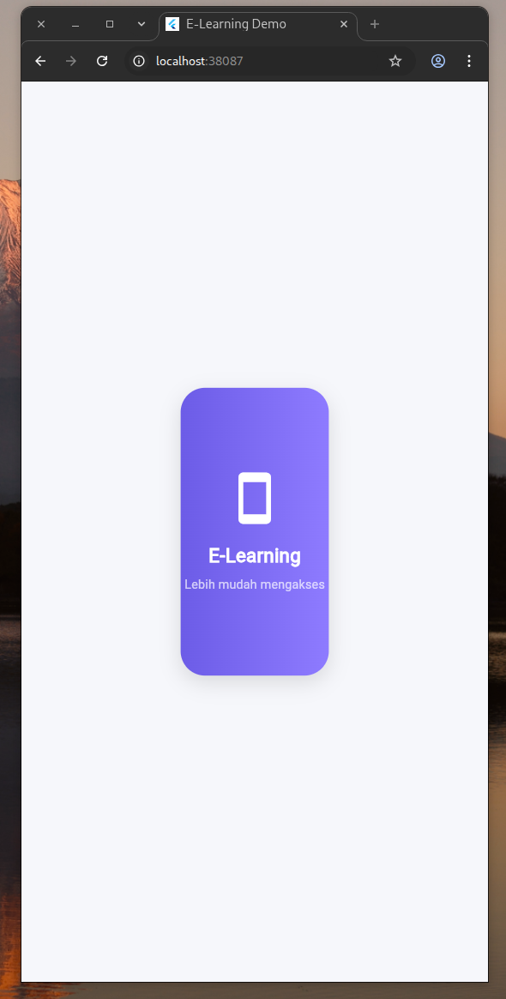
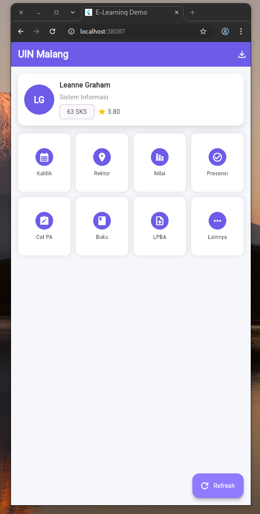

---

## 🖼️ **App Preview**
| Splash Page | Home Page | Study Page |
|--------------|------------|-------------|
|  |  |  |

> 📸 *Screenshot ini dapat diganti dengan hasil implementasi dari aplikasi kamu.*

---

## 📱 **Main Features**
✨ **SplashPage**  
Menampilkan animasi logo dengan efek *elastic scale* menggunakan `AnimationController` dan *Hero transition*.  

🧑‍💻 **HomePage**  
- Menampilkan data pengguna dari API dummy (`jsonplaceholder.typicode.com`).  
- Menyediakan grid menu interaktif (*Kaldik*, *Presensi*, *Nilai*, dll).  
- Dilengkapi tombol **Refresh** untuk memperbarui data.  

📊 **StudyPage**  
- Menampilkan informasi hasil studi (IP Semester, IPK, SKS, dan Nilai Akhir).  
- Simulasi tombol **Download File** untuk pengalaman realistis.  

---

